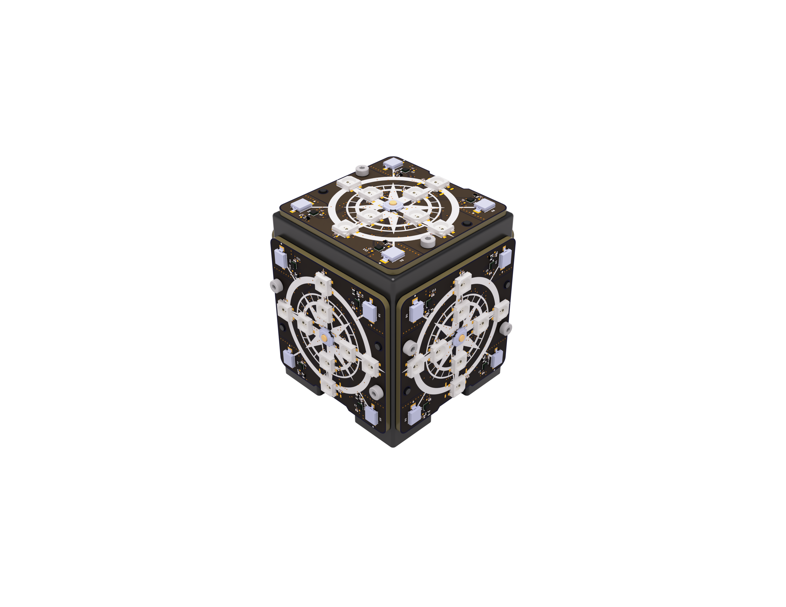

# L-Cube Repository

This repository contains the source code for L-CUBE, a low-cost and easy-to-setup localization system with the Lighthouse base stations. The L-Cube consists of five tiles, which can be used in standalone mode via a serial cable connection, or be aggregated in a cube that can interact with other systems via MQTT or serial connection.

In order to build and setup L-CUBE, the hardware folder contains all components for manufacturing, whereas the README from the src folder provides further information about how to use the software.

### Folder structure

| **Folder** | **Description** |
|---|---|
| assets | Metadata |
| hardware | Informations to build your own hardware |
| src | Arduino (c++) sources for the tiles and cube controller |
| tools | Python tools/scripts to interact with the tiles and cubes |
